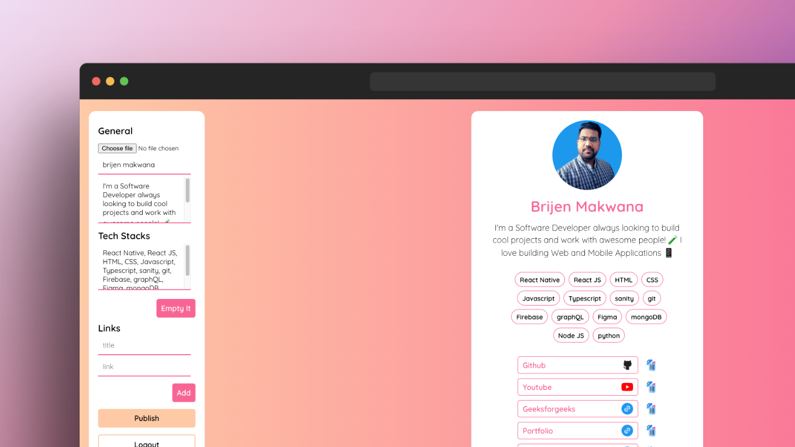
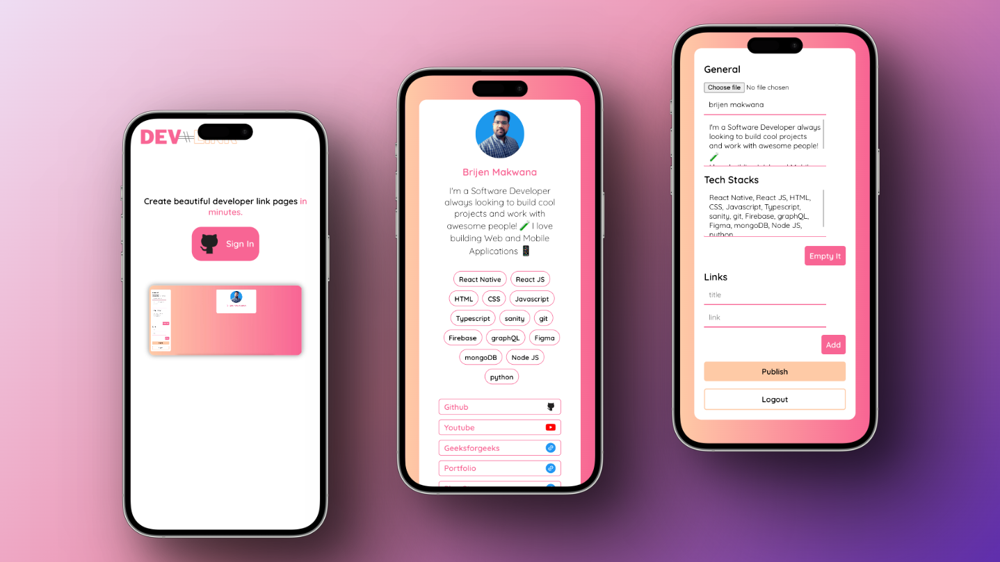

# Devlink

## Table of contents

- [Overview](#overview)
- [Screenshot](#screenshot)
- [Links](#links)
- [Built with](#Built-with)

## Overview

- You can quickly create stunning developer link pages using Devlink.
- Each developer has a variety of links they would like to share with potential employers, colleagues, friends, and other people. You can share all of your links at once in one location using Devlink.
- Developers can sign in with GitHub to create their Devlink profile.
- Developers can post all the key links they wish to share together with their profile photo, name, introduction, and the tech stacks they work on.
- Each developer receives a special URL that they can share with others.

## Screenshot

## Links

- Live Site URL: [https://devlink-page.vercel.app](https://devlink-page.vercel.app)

## Built with

- React
- CSS
- Javascript
- React-Router-Dom
- Firebase
